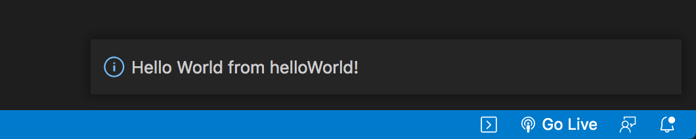
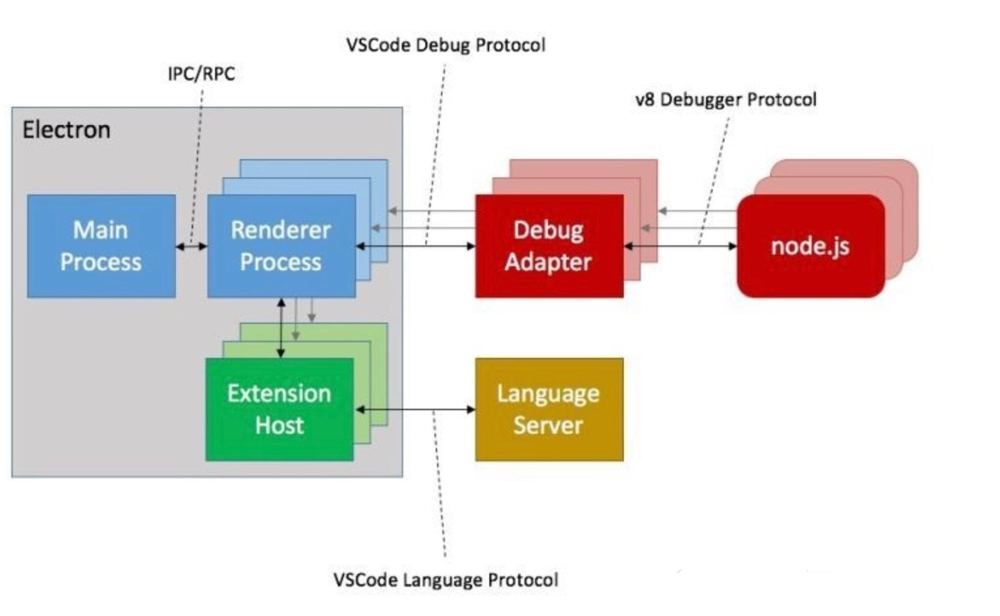

# 快速开始

根据接下来的步骤，我们可以创建一个使用命令激活，输出hello world的插件

1. 安装Yeoman和VS code generator

   ```shell
   npm install -g yo generator-code
   ```

   脚手架——用于自动生成VScode插件模板项目

2. 生成模板项目

   ```shell
   yo code
   ```

   根据需要进行选择(若为首次尝试，可根据下列选项一路回车)

   ```shell
   # ? What type of extension do you want to create? New Extension (TypeScript)
   # ? What's the name of your extension? HelloWorld
   ### Press <Enter> to choose default for all options below ###
   
   # ? What's the identifier of your extension? helloworld
   # ? What's the description of your extension? LEAVE BLANK
   # ? Initialize a git repository? Yes
   # ? Bundle the source code with webpack? No
   # ? Which package manager to use? npm
   ```

3. 运行
   打开刚刚创建好的项目

   ```shell
   code ./helloworld
   ```

   F5运行项目调试

   * 此时将打开一个新的VScode窗口用于插件调试，用于调试的窗口标题栏会标注"[Extension Development Host]"便于区分

   ⬆+command+P打开命令搜索框，输入hello world，运行相关命令

   
   
   在右下角看到弹出的通知框，即为命令运行成功，插件已激活
   
   

# 模板项目解析

根据上一节的步骤，我们成功创建了一个VScode插件，接下来，来看看这个项目中的结构与具体实现吧。

## 目录结构

```
.                   
├── .vscode 
│   ├── launch.json     // 插件加载和调试的配置 
│   └── tasks.json      // 配置TypeScript编译任务
├── .gitignore          // 忽略构建输出和node_modules文件
├── README.md           // 一个友好的插件文档   
├── src                    
│   └── extension.ts    // 插件源代码 
├── package.json        // 插件配置清单
├── tsconfig.json       // TypeScript配置   
```

针对基本功能的开发，我们目前只需要关注*package.json*和*extension.ts*这两个文件，如果你对其他配置文件感兴趣，可以查看VScode的[官方文档](https://code.visualstudio.com/api) 和TypeScript的[官方使用手册](https://www.typescriptlang.org/docs/)。

## 插件配置清单-package.json

```json
{
  "name": "helloworld",
	"displayName": "HelloWorld",
	"description": "", 
	"version": "0.0.1",
	"engines": {
		"vscode": "^1.58.0"   // 这里指定了插件运行所需的VScode版本
	},
	"categories": [
		"Other"   // 插件类型(具体见下一节介绍)
	],
	"activationEvents": [
        "onCommand:helloworld.helloWorld" // 绑定激活事件
	],
	"main": "./out/extension.js",
	"contributes": {
		"commands": [
      // 定义、发布命令helloworld.helloworld
			{
				"command": "helloworld.helloWorld",
				"title": "Hello World"
			}
		]
	},
	"scripts": {
		"vscode:prepublish": "npm run compile",
		"compile": "tsc -p ./",
		"watch": "tsc -watch -p ./",
		"pretest": "npm run compile && npm run lint",
		"lint": "eslint src --ext ts",
		"test": "node ./out/test/runTest.js"
	},
	"devDependencies": {
		"@types/vscode": "^1.58.0",
		"@types/glob": "^7.1.3",
		"@types/mocha": "^8.2.2",
		"@types/node": "14.x",
		"eslint": "^7.27.0",
		"@typescript-eslint/eslint-plugin": "^4.26.0",
		"@typescript-eslint/parser": "^4.26.0",
		"glob": "^7.1.7",
		"mocha": "^8.4.0",
		"typescript": "^4.3.2",
		"vscode-test": "^1.5.2"
	}
}
```

## 源代码-extension.ts

```typescript
// The module 'vscode' contains the VS Code extensibility API
// Import the module and reference it with the alias vscode in your code below
// 引入VScode提供的API
import * as vscode from 'vscode';

// this method is called when your extension is activated
// your extension is activated the very first time the command is executed
// 当插件激活时执行此函数，激活条件即为package.json中注册的命令执行
export function activate(context: vscode.ExtensionContext) {
	
	// Use the console to output diagnostic information (console.log) and errors (console.error)
	// This line of code will only be executed once when your extension is activated
	console.log('Congratulations, your extension "helloworld" is now active!');

	// The command has been defined in the package.json file
	// Now provide the implementation of the command with registerCommand
	// The commandId parameter must match the command field in package.json
  // 将package.json中定义的命令与对应事件注册绑定
	let disposable = vscode.commands.registerCommand('helloworld.helloWorld', () => {
		// The code you place here will be executed every time your command is executed
		// Display a message box to the user
    // 在右下角显示通知框
		vscode.window.showInformationMessage('Hello World from HelloWorld!');
	});

	context.subscriptions.push(disposable);
}

// this method is called when your extension is deactivated
// 在插件停用前执行
export function deactivate() {}

```

最后，让我们来梳理一下，首先你需要在package.json中定义你将用到的命令，并注册能够激活组件的命令，如：输入命令"hello world"、打开JavaScript文件、按下组合按键等；接下来，在extension.ts的activate函数中将你定义的命令与将插件激活后命令触发的函数绑定起来，并在deactivate函数中进行插件停用前的清除，这样就可以实现一个简单的插件啦～

# 插件功能

上一节中，我们对VScode插件的结构进行了解析，几乎所有的插件都是根据这样的结构来进行开发的，本节中，我们将介绍VScode为哪些功能提供了可扩展的API


VScode插件可提供的功能主要为以上五类：

首先是通用的如选择文件、文件夹，收集用户输入，存储工作区或全局数据等基本的功能；

其次是主题相关的，如源代码颜色设置，UI主题设置，icon图标设置等；

第三是语言特性，分为声明式与程序式，声明式主要是文本编辑基础的特性，不包含代码逻辑，如括号匹配显示、自动缩进、语法高亮等，而程序式则需要结合程序语言逻辑，如悬停提示、跳转定义、格式化等；

第四是工作台UI的扩展，可以增加右键菜单、状态栏、侧边栏、webview等，具体对应关系见下图；


最后，是调试相关的功能，可以利用VScode提供的调试功能或自己的调试功能来进行开发。

以上仅为各类插件功能的概要介绍，具体的API见[官方文档](https://code.visualstudio.com/api/references/vscode-api#working-with-extensions-articles)

# VScode命令系统

VScode是微软使用electron框架，100%TypeScript语言开发的桌面端代码编辑器软件，我们能够依照规范自由添加插件，主要源于其平台/插件架构风格的设计，下面将对VScode的设计做简要介绍



VScode采用多进程架构，上图为简要展示，

- 主进程：VSCode 的入口进程，负责如窗口管理、进程间通信、自动更新等全局任务
- 渲染进程：负责一个 Web 页面的渲染
- 插件宿主进程：每个插件的代码都会运行在一个独属于自己的 NodeJS 环境的宿主进程中，插件不允许访问 UI
- Debug 进程：Debugger 相比普通插件做了特殊化
- Search 进程：搜索是一类计算密集型的任务，单开进程保证软件整体体验与性能


如上图，VScode选取的命令系统相较网状的结构更为扁平，能够更加高效地进行功能的调用。

# 扩展阅读

VScode官方文档：https://code.visualstudio.com/api

VScode源码：https://github.com/microsoft/vscode

TypeScript官方文档：https://www.typescriptlang.org/docs/

TypeScript类型体操：https://github.com/type-challenges/type-challenges
