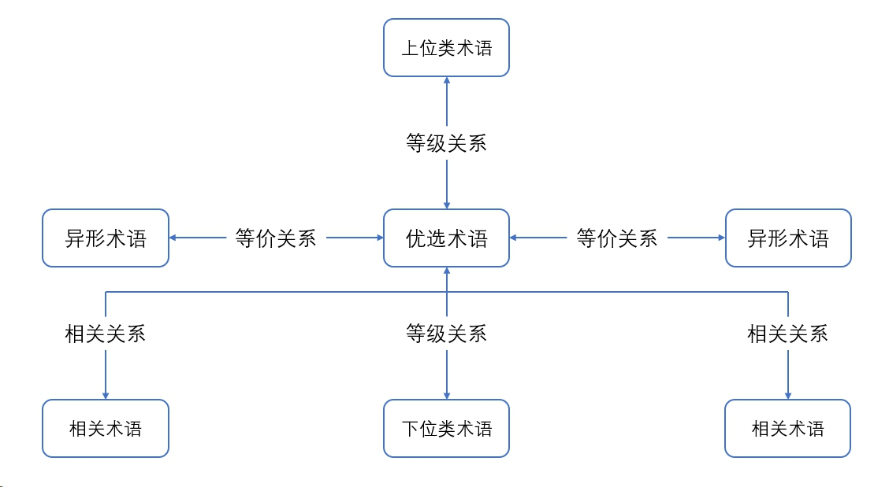
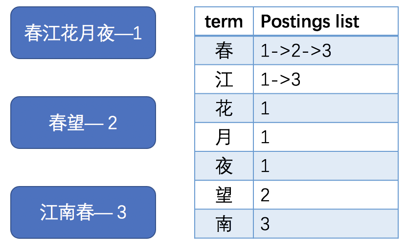
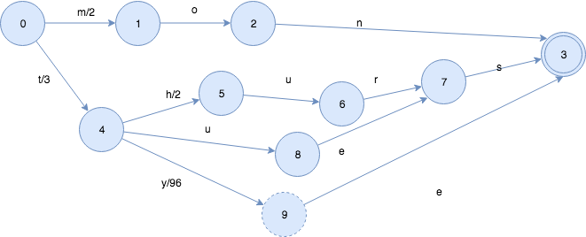
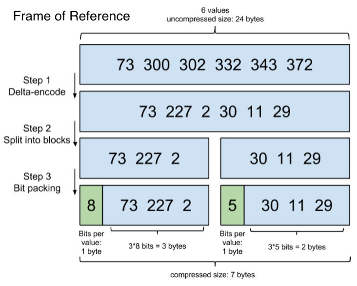
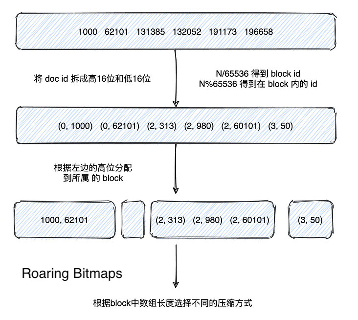

本文将根据elastic search的原理，按照信息检索的一般流程对信息检索进行简要的介绍，旨在从较高层面了解大致流程，不会深入细节和具体实现。

# 数据采集

这一步是为后续的检索提供用于搜索的语料数据，并做预先的处理。

1. 使用爬虫相关技术收集所需数据

2. 数据清洗

   * 去除空数据
   * 去除重复数据
   * 去除明显错误的数据

3. 构建停词表、叙词表

   * 停词表

     无意义的标点、符号、字词等

     [中文常用停词表](https://github.com/goto456/stopwords)

   * 叙词表

     

     主要为同义词表

4. 中文分词

   由于中文没有自然的分隔符，相较于英文分词，难度更大，更易产生歧义，常使用字典、隐马尔可夫模型、机器学习等方法，不是本文的重点，故不做具体介绍。

# 建立倒排索引

倒排索引是实现高效索引的关键，经过分词处理后得到的项作为term项，每项对应其所在文档编号的postings list倒排索引，如下图(例子中为方便举例，直接划分至字，没有进行分词)

同时，为了更高效地对term项进行检索，elastic search采取了[FST](https://www.shenyanchao.cn/blog/2018/12/04/lucene-fst/)的结构，FST(Finite State Transducer)类似于TRIE树的结构，各term项可共用相同的前缀或后缀，但不同的 term项到达结尾计算到的数值不同。

下图即为完整的term dict index词典索引树、term dict词典、invert index倒排索引的大致结构。

## 优化

对于大规模的信息检索，其数据量往往会达到十分庞大的程度，此时能否高效地存取也是影响检索效率的一个重要因素。针对这一问题，elastic search采取了下列两种方法进行磁盘压缩存储与缓存查询优化。

1. Frame of Reference

   此方法流程如下图，首先将文档列表处理为增量列表，然后将其划分为大小为256的块，然后进行按需分配，这里每块的第一位将记录块内各项所需的位数，之后各项根据最大项所需的位数存储。这样，就实现了压缩存储的倒排索引。

   

2. Roaring Bitmaps

   上述的Frame of Reference方法很好地解决了倒排索引在磁盘中的存储问题，而对于分块存储的倒排索引来说，需要频繁的求并集，面对多条件查询时还需要进行交集操作，对于快速的交并集操作，elastic search采用了Roaring Bitmaps的方法，在缓存中进行压缩。

   在介绍Roaring Bitmaps之前，我们先来介绍两种压缩方法：

   1. 数组

      也就是直接使用原始的文档ID，进行数组操作，但这种方法显然不适合elastic search每次计算的数据量。

   2. Bitmap

      Bitmap是一个常用的数据结构，我们通过一个例子来了解一下他的结构，我们现在有[2,3,5]和[1,3,4,5]两个数组，将其使用Bitmap来表示即为[0,0,1,1,0,1]和[0,1,0,1,1,1]，也就是原数组中的值所对应的Bitmap中相应脚标的值为1，其余为0。这样如果我们要对两个数组取交集，那么我们就对他们的Bitmap做与运算，取并集，就做或运算。

   我们看到Bitmap比较好地完成了对数组的压缩，无论原文档列表中各项的大小是多少，在bitmap中都只需要用一位的0或1来表示。事实上，相当长一段时间内，elastic search都是采用这种方法的，直到lucene5开始使用Roaring Bitmaps，这主要是为了解决Bitmap在稀疏情况下造成的空间浪费。

   对于文档列表，使用N/65536得到该文档对应的块号，然后使用N%65536得到该文档在块内的id，接下来根据不同的块号将文档分配的所属的块，最后根据块内文档数进行数组或位图的选择，这里的阈值来源于实际数据，当超过4096时选用位图，反之选用数组。

   

# 相关度计算

上一节中介绍的倒排索引让我们能够快速找到包含检索词的文档，但是当相关文档很多时，如果直接按照存储顺序呈现给用户，往往不会带来比较好的体验，我们需要计算文档与检索词的相关度，将最符合用户检索需求的结果排在靠前的位置。

为了进行相关度的计算，让我们先来了解几个参数
$$
词频：tf_{t \in d} = \sqrt{frequency}
$$

$$
逆向文档频率：idf_t = 1 + \log(\frac{numDocs}{docFreq+1})
$$

$$
字段长度归一值：norm_d = \frac{1}{\sqrt{numTerms}}
$$

其中：

* $frequency$代表词t在文档d中出现的次数
* $numDocs$代表索引中文档数量
* $docFreq$代表包含词t的文档数
* $numTerms$代表所在字段的词数

由此，相关度计算公式如下：
$$
score_{q,d} = coord_{(q,d)} * \sum_{t \in q}{tf_{t \in d} * idf_{t}^2 * Boost * norm_{(t,d)}}
$$
其中，$coord_{(q,d)}$为$\frac{文档中包含的查询词数}{查询词总数}$，$Boost$为设定参数

# 排序

上一节中，我们已经根据词频等数据计算得到了各篇文档的相关度，接下来需要对其进行排序，大量数据表明，按相关度降序排序后的前20条结果可以满足大多数用户的一般查询需求。因此，通常情况下我们不需要将全部查询结果返回给用户，只需要将前K个最符合查询需求的记录返回给用户即可，这里的K通常为20。

这也就是十分常见的[topK问题](https://leetcode-cn.com/problems/zui-xiao-de-kge-shu-lcof/)，最基础的解法是将全部数据进行排序，然后取其前K个，但这种方法复杂度较高，在数据量比较大的时候并不适用。

一般来讲，我们采用最大堆/最小堆的方法，我们维护一个有前k个最大值构成的小顶堆，每拿到一个数据，就将其与堆顶数据比较，如果大于堆顶数据，则将堆顶数据删除，将新数据插入，反之则不做处理，这样当对全部数据遍历一遍后，堆中数据即为前k个最大值。若使用大顶堆，则开始遍历前对全部数据取反即可。

还可以使用快排的思想来解决topK问题，但实现过程较堆的过程相对复杂，故本文不做介绍，感兴趣的朋友可以自行探索。
